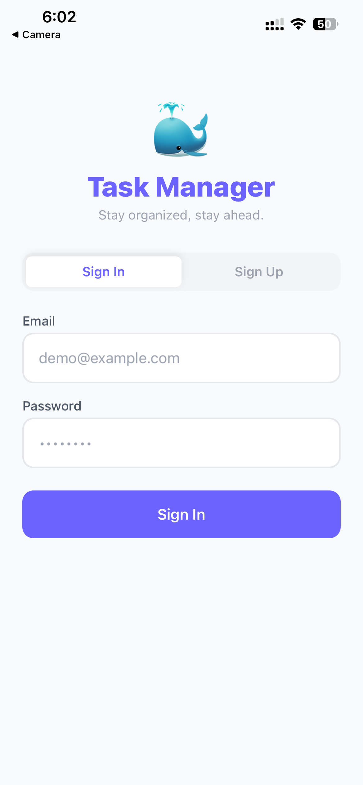
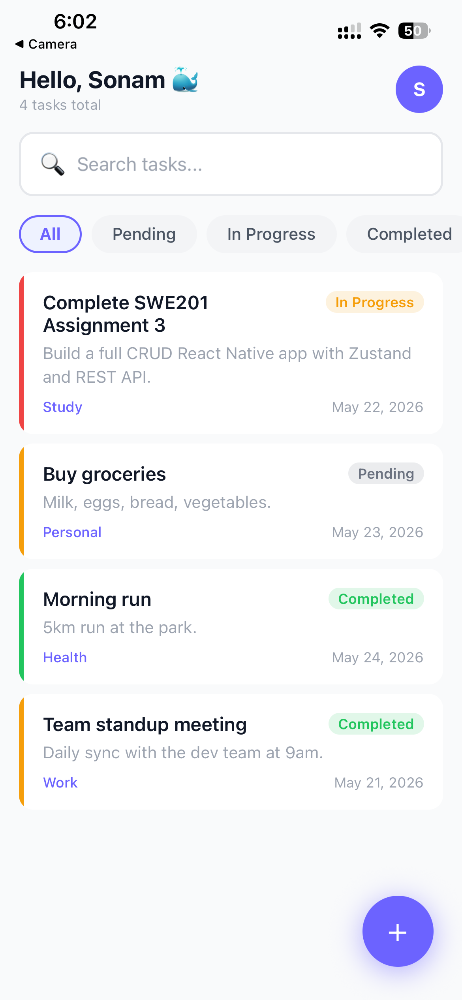
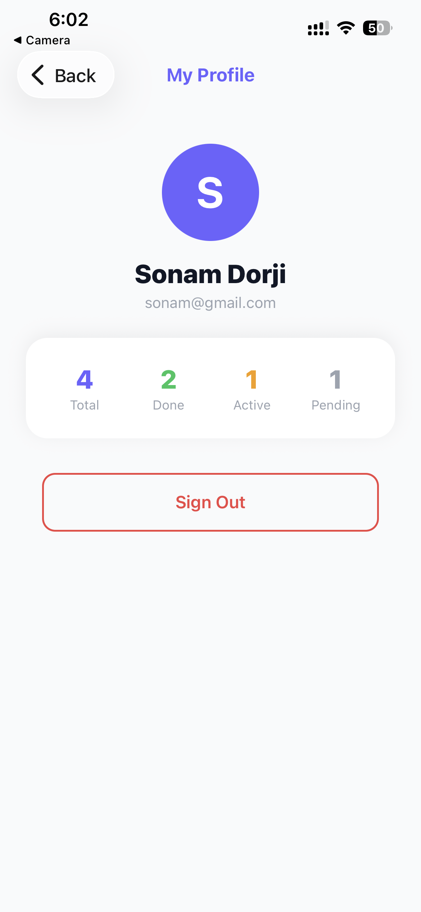
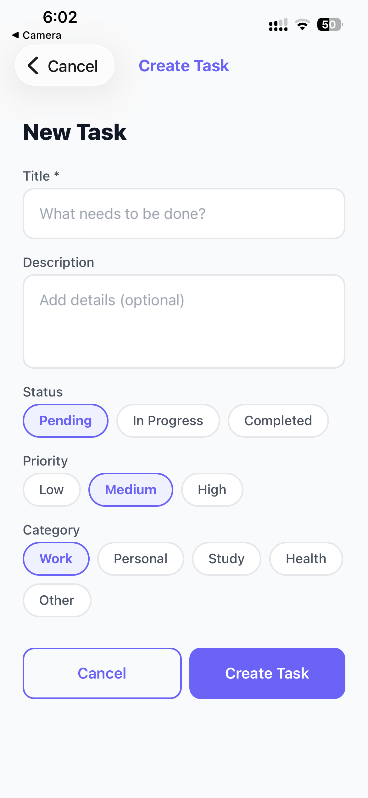
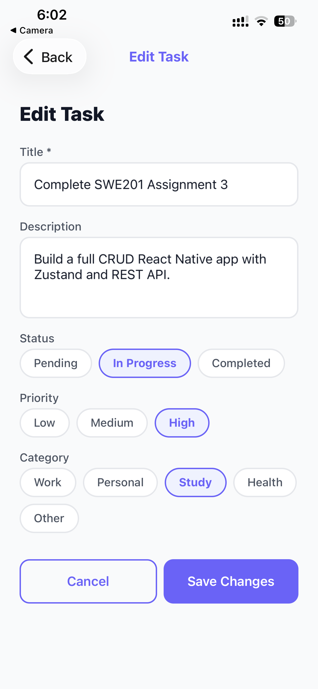

# 🐳 Task Manager App

A React Native (Expo) mobile app for managing your daily tasks. Create, view, edit, and delete tasks with priority levels, status tracking, and category organisation all with a clean, intuitive interface.

---

## Domain & Entities

**Domain:** Task Management

### Primary Entity — Task

| Field | Type | Description |
|-------|------|-------------|
| `id` | String | Unique identifier |
| `title` | String | Task name (required, 3–100 characters) |
| `description` | String | Optional details (max 500 characters) |
| `status` | Enum | `pending` \| `in-progress` \| `completed` |
| `priority` | Enum | `low` \| `medium` \| `high` |
| `category` | String | Work, Personal, Study, Health, or Other |
| `createdAt` | ISO Date | Timestamp of creation |

### Secondary Entity — Category

Categories link each task to a domain area and are used for filtering. Supported values: **Work, Personal, Study, Health, Other**.

---

## State Management

**Library: Zustand**

Zustand was chosen over Redux and Context API for the following reasons:

- No boilerplate — no actions, reducers, or provider wrappers needed
- Async-friendly — store actions can be `async` functions without extra middleware
- Components subscribe directly to only the slice of state they need
- Tiny bundle size, ideal for React Native

**What lives in global state:**
- `user` and `token` — auth session, rehydrated from AsyncStorage on app start
- `tasks[]` — full list fetched from the backend
- `filterStatus` — active filter pill, persisted to AsyncStorage

**Custom hooks:**
- `useForm(initialValues, validate)` — reusable form state with validation and submission loading
- `useFetchTask(id)` — fetches a single task by ID with retry support

---

## Backend Details

**Technology:** Local in-memory mock service (`src/api/tasksService.js`)

The app uses a local mock backend to ensure it works reliably without any external service dependency. All CRUD operations update an in-memory array with a simulated network delay so loading indicators behave realistically.

### Endpoints

| Method | URL | Purpose |
|--------|-----|---------|
| `GET` | `/tasks` | Fetch all tasks |
| `GET` | `/tasks/:id` | Fetch a single task by ID |
| `POST` | `/tasks` | Create a new task |
| `PUT` | `/tasks/:id` | Update an existing task |
| `DELETE` | `/tasks/:id` | Delete a task |

> All request and response payloads use JSON format.

---

## Setup Instructions

### Prerequisites

- **Node.js** 18 or later
- **Expo Go** app installed on your phone:
  - [Download for iOS](https://apps.apple.com/app/expo-go/id982107779)
  - [Download for Android](https://play.google.com/store/apps/details?id=host.exp.exponent)

### Install Dependencies

```bash
npm install
```

### Run the App

```bash
npx expo start
```

Then scan the QR code shown in the terminal using:
- **iOS** — Camera app
- **Android** — Expo Go app

### Run on a Specific Platform

```bash
# Android emulator
npx expo start --android

# iOS simulator (Mac only)
npx expo start --ios
```

### Connect to the Backend

No setup required. The backend is built into the app as a local in-memory mock service. It starts automatically when the app launches with 4 sample tasks pre-loaded.

### Demo Login Credentials

| Email | Password |
|-------|----------|
| sonam@gmail.com | 123456 |
| test@example.com | test123 |

You can also create a new account from the Sign Up screen.

---

## Known Limitations

- **Auth is mock only** — credentials are validated locally; there is no real backend auth server
- **Data does not persist between sessions** — tasks are stored in memory and reset when the app is fully closed
- **No offline mode** — the app does not cache tasks for offline use
- **No image attachments** — tasks support text fields only
- **No pagination** — all tasks are loaded at once; performance may degrade with very large lists

## Screenshots
<table>
  <tr>
    <td></td>
    <td></td>
  </tr>
  <tr>
    <td></td>
    <td></td>
  </tr>
  <tr>
    <td></td>
    <td></td>
  </tr>
</table>