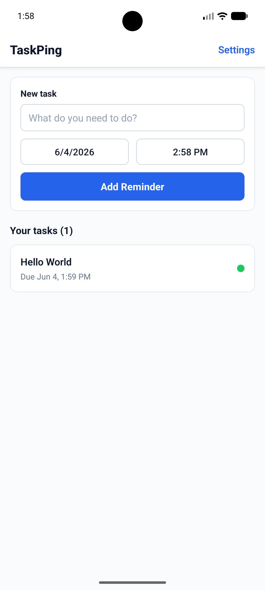
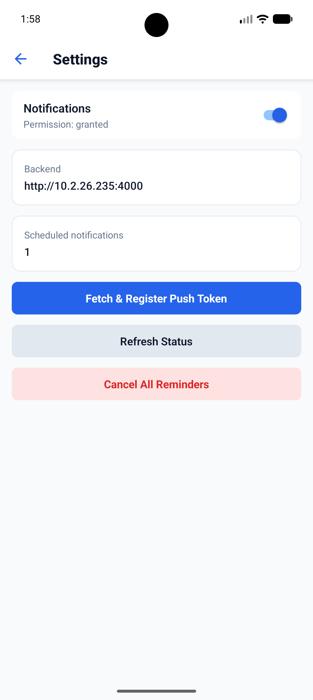
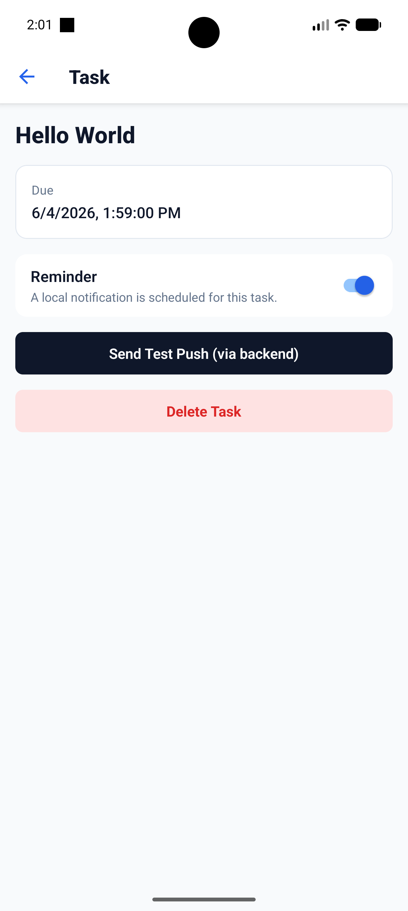
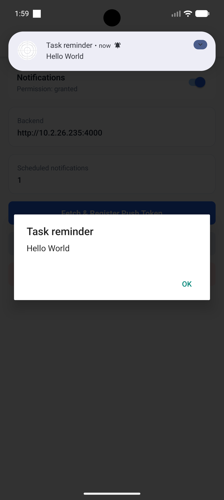

# Task Ping — Task Manager with Reminders

Small React Native (Expo) app for creating, organising and reminding users
about tasks. Supports local scheduled reminders and server-triggered push
notifications for cross-device / broadcast scenarios.

**Domain:** Task Management

**Short description:** Create, view, edit and delete tasks with priorities,
categories and scheduled reminders. Notifications help users remember due tasks
and let a simple backend trigger pushes for testing or broadcast messages.

**Main files:** Task state & scheduling live in `store/TaskContext.tsx` and
notification logic is implemented in `notifications/notificationService.ts`.

**Primary user scenario (notifications):**
- A user schedules a reminder for a task; the app schedules a local notification
	at the selected date/time.
- Optionally the device registers its Expo push token with the local backend
	so the backend can trigger pushes (useful for testing broadcast messages).

**Notifications summary**

- **Types implemented:**
	- **Local reminders:** scheduled on-device via `expo-notifications`.
	- **Remote / server-triggered:** the Express backend calls the Expo Push
		API to deliver push messages to registered Expo push tokens.

- **How different states are handled:**
	- **Foreground:** `setNotificationHandler` shows an in-app banner and plays
		sound (toast-style) so users receive immediate feedback while using the app.
	- **Background / System tray:** the OS displays the notification; tapping
		it opens the app and the response listener deep-links to the task detail.
	- **Tapped (cold start / resume):** `getLastNotificationResponseAsync()` is
		checked on startup and the app navigates to `TaskDetailScreen` when a
		`taskId` is present in the notification payload.

See `notifications/notificationService.ts` for the exact implementation.

**Backend details**

- **Technology / service used:** Lightweight Express server (TypeScript) in
	`backend/index.ts` that proxies to the Expo Push API. Device tokens are
	stored in-memory for demo purposes.

- **Main endpoints (method + URL + purpose):**
	- `GET /health` — check server health and number of registered tokens.
	- `POST /register-token` — register or upsert an Expo push token (body: `{ token }`).
	- `POST /send-notification` — send a push via the Expo Push API (body: `{ token?, title, body, data? }`).

Note: task data is stored in-app (in-memory) by `TaskContext` and does not use
the Express backend; the backend is dedicated to push delivery/testing.

**How notifications are wired**

- The app requests permissions and can fetch the Expo push token via
	`notifications/getExpoPushToken()`.
- The app calls `POST /register-token` to store the token on the backend.
- To test remote pushes, call `POST /send-notification` on the backend (or use
	the app's `sendTestPush` helper) — the backend forwards messages to the
	Expo Push API which routes to devices running the app.

Example: register token (curl)

```
curl -X POST http://localhost:4000/register-token \
	-H "Content-Type: application/json" \
	-H "x-api-key: dev-public-key" \
	-d '{"token":"ExponentPushToken[xxxxxxxxxxxxxxxxxxxx]"}'
```

Example: send test push (curl)

```
curl -X POST http://localhost:4000/send-notification \
	-H "Content-Type: application/json" \
	-H "x-api-key: dev-public-key" \
	-d '{"title":"Test","body":"Hello from backend","data":{}}'
```

**Setup & Run**

- Prerequisites:
	- Node.js 18+ and npm
	- `expo` CLI (install globally if you prefer) or use `npx expo` commands
	- For Android FCM push token support in standalone builds: add `google-services.json` and follow the Expo docs

- Install dependencies:

```
npm install
```

- Start the Expo app (development):

```
npx expo start
```

Open in Expo Go by scanning the QR code or use `--android` / `--ios` flags.

- Run the local backend (notification trigger):

```
# dev run (TypeScript):
npx ts-node backend/index.ts

# or compile + run in prod:
tsc -p tsconfig.json && node backend/index.js
```

The Express backend listens on port 4000 by default. Protected routes require
the `x-api-key` header (defaults to `dev-public-key`).

**How to test notifications end-to-end**

1. Grant notification permissions when prompted in the app.
2. From the app, call the API to obtain the Expo push token and register it
	 with the backend (this happens automatically in the demo flow where
	 `registerPushToken` is used).
3. Trigger a remote push via the app helper or by calling `POST /send-notification`.
4. Alternatively, schedule a local reminder from a task — the app will show
	 the notification at the scheduled time.

**Limitations & Notes**

- Auth and token storage are mock/in-memory for demo only — tokens and tasks
	reset when the app / server restarts.
- Remote push testing uses the Expo Push API. For production Android builds
	you must configure FCM / `google-services.json` and rebuild the native app.
- The app was developed and tested primarily with Expo Go; behaviour can
	differ on standalone builds and iOS simulator (pushes require a real device).

**Files of interest**
- `notifications/notificationService.ts` — Expo Notifications integration
- `backend/index.ts` — simple Express push proxy for testing
- `store/TaskContext.tsx` — task store + local scheduling logic

## Screenshots
<table>
	<tr>
		<td></td>
		<td></td>
	</tr>
	<tr>
		<td></td>
		<td></td>
	</tr>
</table>

